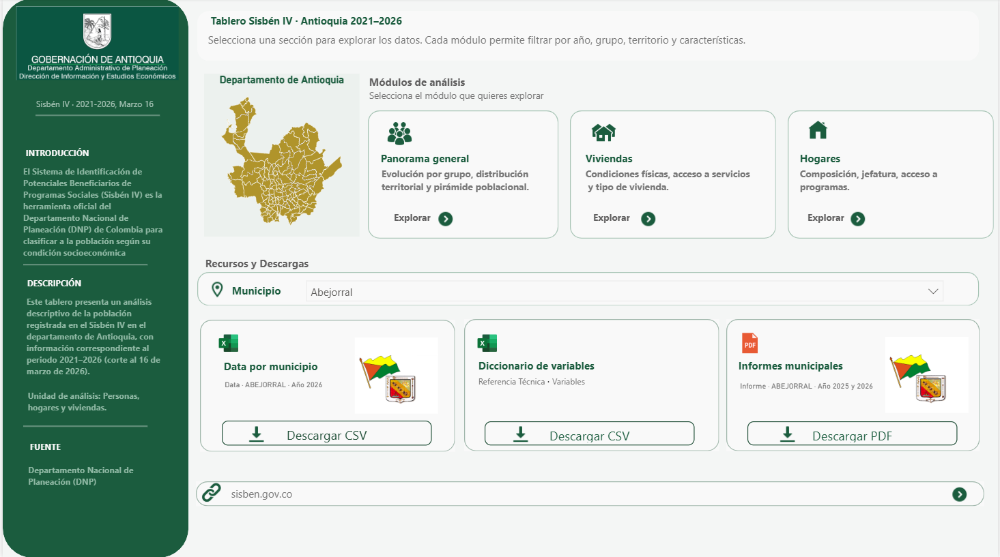
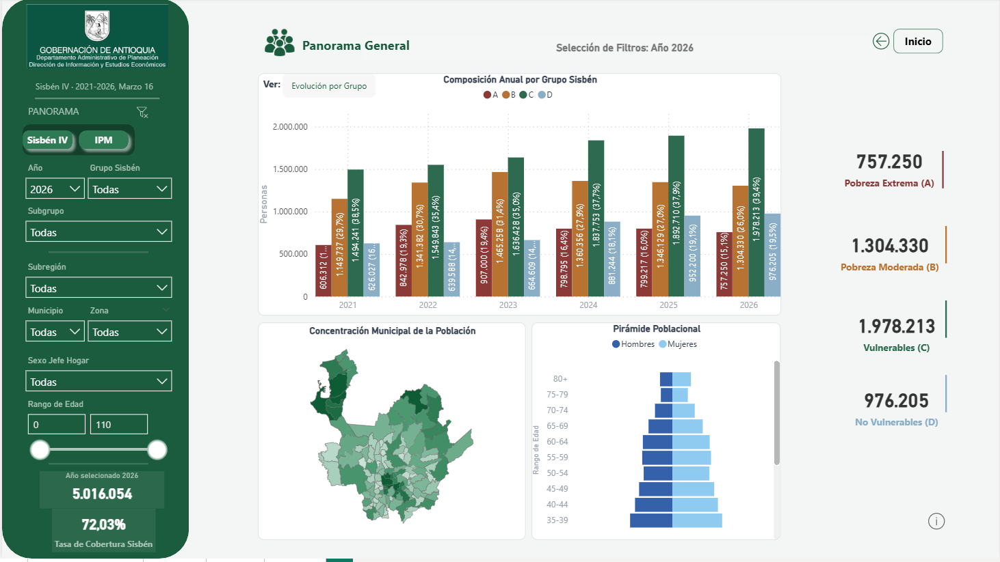
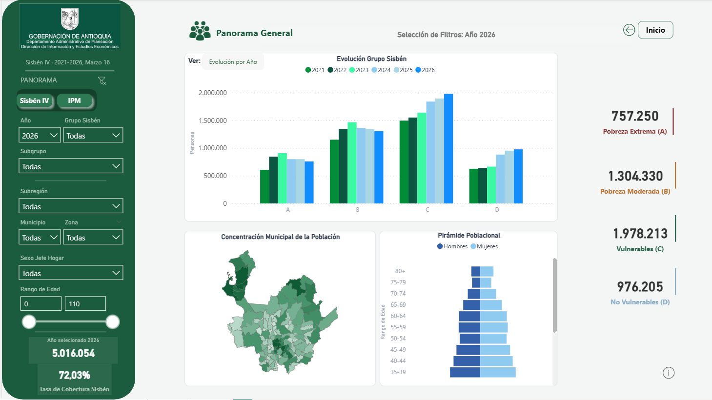
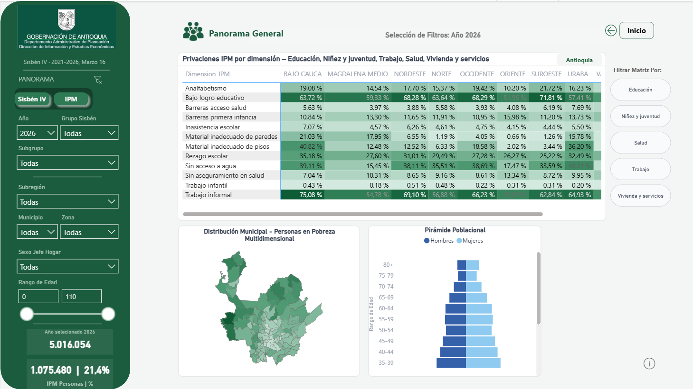
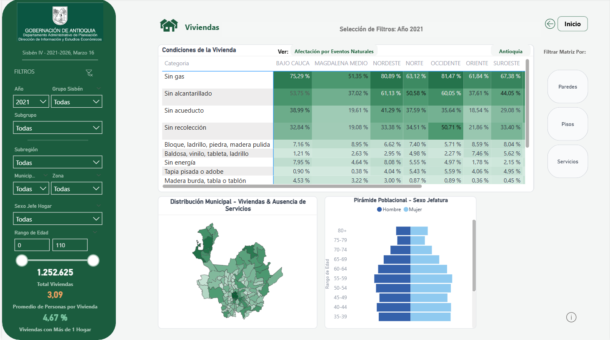
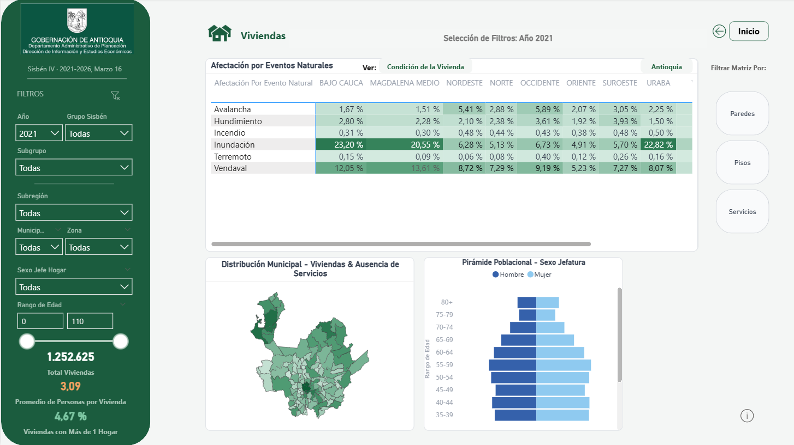
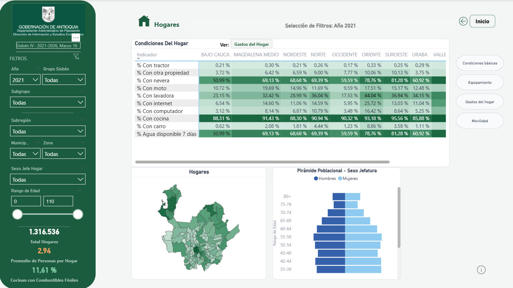
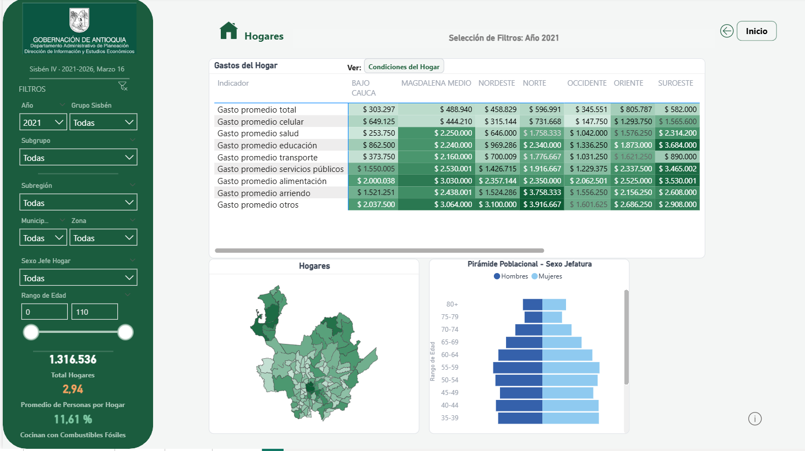
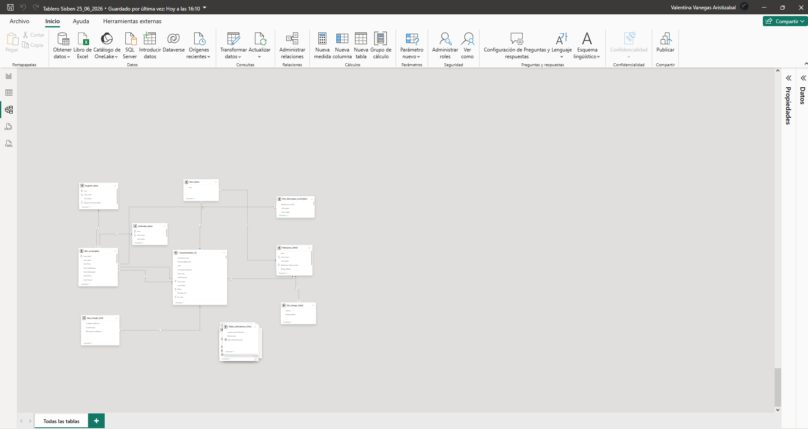

# SISBEN IV — ETL Pipeline & Power BI Analytics

End-to-end data pipeline for processing, validating, and analyzing SISBEN IV microdata across all 125 municipalities of Antioquia, Colombia. The project integrates data sources from the DNP, DANE, and the Gobernación de Antioquia, and delivers results through a tabular semantic model in Power BI.

---

## Dashboard Preview

| Home | Panorama General |
|---|---|
|  |  |

| IPM View | Territorial Distribution |
|---|---|
|  |  |

| Population Pyramid | Housing & Households |
|---|---|
|  |  |

| Housing Detail | Households Module |
|---|---|
|  |  |

**Relational Model — Power BI Semantic Layer**



---

## Background

SISBEN IV is Colombia's primary social targeting instrument. This repository contains the code built to automate the ingestion, cleaning, quality validation, and analytical modeling of SISBEN IV microdata for Antioquia — covering over 4 million individual records and 26 computed columns derived from the DNP's original variables.

The pipeline feeds a Power BI dashboard that enables the Gobernación to query coverage rates, deprivation indices (MPI), household composition, housing quality, and socioeconomic profiles by municipality, area, and survey year.

---

## Tech Stack

| Layer | Tools |
|---|---|
| Ingestion & transformation | Python · Pandas · PyArrow · DuckDB |
| Intermediate storage | Parquet (columnar format) |
| Data quality | Custom audit scripts |
| Analytical model | Power BI · TMDL · DAX |
| Distribution | OneDrive / SharePoint · Per-municipality CSV |
| Automation | PowerShell · Python scripts |

---

## Repository Structure

```
sisben-iv-etl-analytics-pipeline/
│
├── src/
│   ├── etl/                       # Extraction and transformation pipelines
│   │   ├── etl_sisben_definitivo.py       # Main pipeline (SISBEN IV)
│   │   ├── etl_dane_viviendas_hogares.py  # DANE projections (households & dwellings)
│   │   ├── etl_poblacion_cobertura.py     # Population coverage by municipality
│   │   └── upload_recursos.py             # File distribution to SharePoint
│   │
│   ├── data_quality/              # Schema auditing and validation
│   │   ├── check_schema.py                # Data type verification
│   │   ├── dax_audit.py                   # DAX measure validation
│   │   ├── strict_audit.py                # Strict integrity audit
│   │   └── reinforce_parquet.py           # Parquet schema enforcement
│   │
│   └── utils/                     # Post-processing and utilities
│       ├── post_process_municipios.py     # CSV enrichment and renaming
│       ├── gen_dim_only.py                # Dimension table generation
│       └── tmdl_reorganize.py             # TMDL model reorganization
│
├── model/                         # Power BI semantic model definition
│   ├── tmdl_sisben/               # Full tabular model in TMDL format
│   │   ├── model.tmdl
│   │   ├── relationships.tmdl
│   │   ├── expressions.tmdl
│   │   └── tables/                # 19 tables: dimensions, facts, and calculated
│   ├── deploy_dq_model.ps1        # Model deployment script
│   └── master_audit_fixed.ps1     # Full model audit automation
│
├── docs/                          # Technical documentation
│   ├── Documentacion/             # PDF manuals and methodology docs
│   │   ├── Doc_Metodologico_Transformacion_DATA.pdf
│   │   ├── Eficiencia_ETL_Parquet.pdf
│   │   ├── Explicacion_Tablas_Parametro.pdf
│   │   ├── Manual_Script.pdf
│   │   └── Tour_Tablero_Sisben.pdf
│   ├── Documento_Metodologico_Sisben_Actualizado.tex
│   ├── presentacion_modelo_sisben.tex
│   └── presentacion_tablas_parametro.tex
│
├── data/                          # Public reference data and dictionaries
│   ├── Variables.xlsx             # SISBEN IV variable dictionary (DNP)
│   ├── DIVIPOLA_EAT_GOBANT.xlsx   # DIVIPOLA geographic codes — Gobernación
│   ├── anexo-proyecciones-hogares-dptal-mpal-2018-2042.xlsx
│   └── anexo-proyecciones-viviendas-dptal-mpal-2018-2042.xlsx
│
├── .gitignore
├── requirements.txt
└── README.md
```

---

## Key Modules

### `etl_sisben_definitivo.py`

The core of the pipeline. Processes the master microdata file in **chunk mode** (150,000-row batches) to operate within memory limits on multi-million-row datasets.

Responsibilities:
- Type normalization (Int64 nullable, strings, dates).
- Calculation of **26 derived columns**: socioeconomic classification, age ranges, health coverage regime, overcrowding categories, housing deprivation indicators (MPI), and more.
- Consolidated Parquet output generation.
- Per-municipality CSV generation via **DuckDB** (SQL processing over Parquet).
- Dimension table `dim_descargas_municipios` with SharePoint direct-download URLs.

```python
# Overcrowding calculation on each chunk
_personas = pd.to_numeric(df["num_personas_hogar"], errors="coerce")
_cuartos  = pd.to_numeric(df["num_cuartos_vivienda"], errors="coerce").replace(0, np.nan)
df["Personas_por_Cuarto"] = (_personas / _cuartos).astype("Float64")
df["Cat_Hacinamiento"] = np.where(_ppc > 3, "Hacinado", "No hacinado")
```

### `etl_dane_viviendas_hogares.py`

Processes official DANE projections (households and dwellings) for Antioquia municipalities, 2018–2042. Performs a **wide-to-long melt**, aligns DANE codes with DIVIPOLA, and generates the reference Parquet files for coverage indicators.

### `post_process_municipios.py`

Post-processes the per-municipality CSVs on OneDrive: standardizes filenames using DIVIPOLA encoding, adds the `nom_mpio` column, and regenerates the download dimension CSV with public SharePoint URLs.

### `upload_recursos.py`

Automates distribution of static resources (variable dictionary and municipal PDF reports) from the local environment to OneDrive folders synced with SharePoint, updating URLs in the dimension CSV.

---

## Semantic Model (TMDL)

The `model/tmdl_sisben/` directory contains the complete Power BI tabular model in **TMDL** (Tabular Model Definition Language), enabling Git versioning and programmatic deployment.

| Type | Tables |
|---|---|
| Fact table | `fct_Sisben` (individual microdata records) |
| Dimensions | `dim_municipios`, `Dim_Anios`, `Dim_Rango_Edad`, `Dim_Estado_DNP`, `Dim_Marca_DNP`, `Nivel_Sisben`, `Dim_Privacion`, `Dim_IPM_Dimension` |
| Housing dimensions | `Dim_Categoria_Vivienda`, `Dim_Bloque_Sanitario`, `Dim_Tipo_Evento`, `Dim_Evento`, `Tabla_Indicadores_Vivienda` |
| DANE tables | `Poblacion_DANE`, `Hogares_DANE`, `Viviendas_DANE` |
| Auxiliary | `Selector_Vivienda`, `Dim_Indicador_Hogar` |

---

## Getting Started

### Requirements

```bash
pip install -r requirements.txt
```

### Environment setup

Configure the following paths before running the ETL scripts:

```bash
SISBEN_PARQUET_IN   # Input Parquet path with microdata
SISBEN_PARQUET_OUT  # Output path for processed Parquet
SISBEN_CSV_DIR      # Output directory for per-municipality CSVs
ONEDRIVE_SYNC_DIR   # Local folder synced with SharePoint
```

### Run the main pipeline

```bash
python src/etl/etl_sisben_definitivo.py
```

### Run quality audits

```bash
python src/data_quality/strict_audit.py
python src/data_quality/dax_audit.py
```

---

> **Note on sensitive data:** SISBEN IV microdata contains personal information protected under Colombian Law 1581/2012. Parquet files and CSVs with individual records are not included in this repository.

---

## Author

Valentina Vanegas — Data Analyst  
Project developed for SISBEN IV data analysis at the Gobernación de Antioquia.
